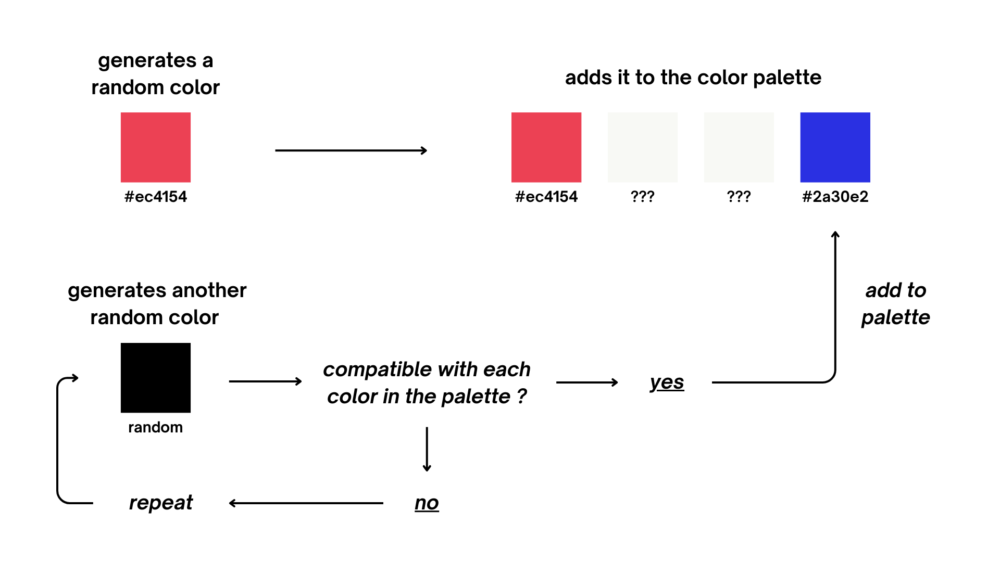
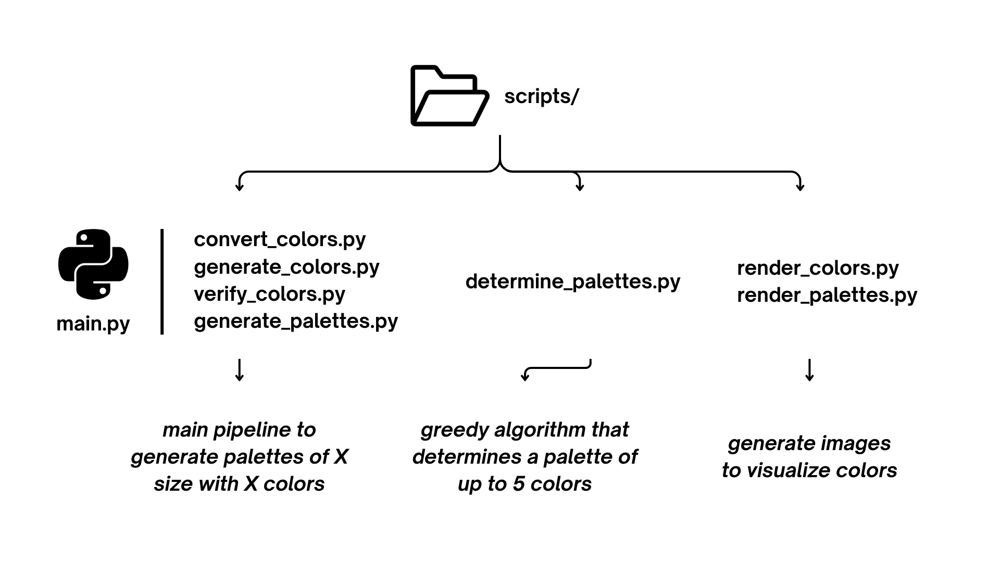

# Methodology

This document explains the methodology behind Colorally.

## 1. Core Algorithm Approach

### Constraint-Based Random Generation (Monte Carlo)

Colorally uses a Monte Carlo approach with constraint verification to generate accessible color palettes.  
The algorithm works as follows:

1. The process starts by generating a random color
2. This color is added to the palette
3. Another random color is generated
4. The new color is checked for compatibility with each existing color in the palette
   - A color is considered compatible if it has sufficient perceptual distance in all vision modes
   - I use different thresholds for each vision mode: ΔE ≥ 10 for normal vision and ΔE ≥ 15 for protanopia, deuteranopia, tritanopia, and grey scale
5. If compatible, the color is added to the palette; if not, the process repeats
6. This continues until the desired palette size (2-5 colors) is reached
7. To prevent infinite loops, I've implemented a failure limit. If too many consecutive incompatible colors are generated, the algorithm resets and starts over with a new base color

### Greedy Maximum Palette Algorithm

For exploring the theoretical maximum palette size, I implemented a greedy algorithm in the `determine_palettes.py` script.

This algorithm has identified that 5 colors is currently the maximum achievable while maintaining my strict constraints. The limiting factor is mainly the grey scale distance requirement.

| Color    | Discovery Time | Total Duration | Delta E Thresholds |
|----------|----------------|----------------|--------------------|
| #000000  | 0.00            | 3146.78         | normal:10.0 \| protanopia:15.0 \| deuteranopia:15.0 \| tritanopia:15.0 \| grey scale:15.0 |
| #0036f8  | 0.84            | 3146.78         | normal:10.0 \| protanopia:15.0 \| deuteranopia:15.0 \| tritanopia:15.0 \| grey scale:15.0 |
| #007afb  | 2.79            | 3146.78         | normal:10.0 \| protanopia:15.0 \| deuteranopia:15.0 \| tritanopia:15.0 \| grey scale:15.0 |
| #00b8a5  | 5.63            | 3146.78         | normal:10.0 \| protanopia:15.0 \| deuteranopia:15.0 \| tritanopia:15.0 \| grey scale:15.0 |
| #00f8fc  | 9.80            | 3146.78         | normal:10.0 \| protanopia:15.0 \| deuteranopia:15.0 \| tritanopia:15.0 \| grey scale:15.0 |

The generation was done on my Mac M2 and starts from a HEX value of #000000 up to #FFFFFF (maximum).

## 2. Project Architecture

The project is organized into different python scripts:

- **Main Pipeline (`main.py`):**
  - `scripts/convert_colors.py`
  - `scripts/generate_colors.py`
  - `scripts/verify_colors.py`
  - `scripts/generate_palettes.py`

- **Greedy Algorithm:**
  - `scripts/determine_palettes.py`

- **Visualization:**
  - `scripts/render_colors.py`
  - `scripts/render_palettes.py`

## 3. Detailed Generation Process

The palette generation process consists of the following key steps:

1. **Color Generation**:
   - Colors are initially generated in RGB color space
   - Colors are represented as hexadecimal values (ex: #EC4154)

2. **Color Space Conversion**:
   - Colors in RGB are converted to sRGB (change of scale)
   - The complete workflow follows: sRGB → Linear RGB → Machado matrices → Linear RGB → sRGB
   - Additional conversions (Linear RGB → XYZ → Lab)
   - For grey scale conversion, the luminance coefficients are applied directly to sRGB values without conversion to linear space. While technically less colorimetrically correct this approach is justified for grey scale printing as printer drivers are optimized for direct sRGB values. It avoids the mid-tone compression that results from double transformation (sRGB → linear → sRGB) and produces clearer distinctions between categories on paper.

3. **Color Blindness Simulation**:
   - Each color is simulated in different vision modes using Machado matrices
   - Simulations include protanopia, deuteranopia, tritanopia
   - This constitutes a multi-observer simulation evaluation, where I assess how different types of vision perceive color differences

4. **Compatibility Verification**:
   - The CIEDE2000 formula calculates perceptual distance between colors (`scripts/verify_colors.py`)
   - Distance is checked in all vision modes (normal, protanopia, deuteranopia, tritanopia, grey scale)
   - I use varying thresholds for different vision types:
     - Normal vision: ΔE ≥ 10
     - Protanopia, Deuteranopia, Tritanopia, and Grey scale: ΔE ≥ 15
   - These thresholds were determined through my extensive manual testing to ensure optimal distinguishability across all vision types

5. **Palette Construction**:
   - Compatible colors are progressively added to build the palette
   - The process continues until the target palette size is reached (between 2-5 colors)

To sum up, for a palette to be formed, each generated color must pass the verification tests against each color already in the palette across all vision modes. For example, we compare: c1 normal VS c2 normal (above threshold), c1 protanopia VS c2 protanopia, and so on for all vision types, ensuring the Delta E (ΔE) is above the threshold for each comparison.
